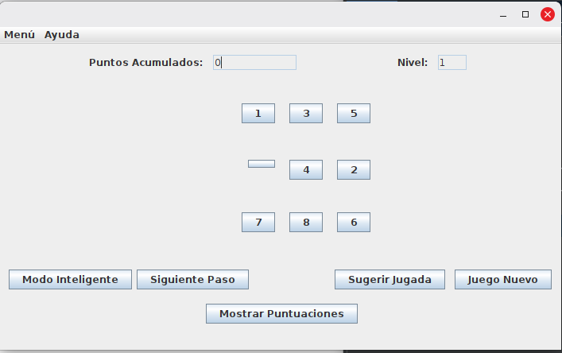
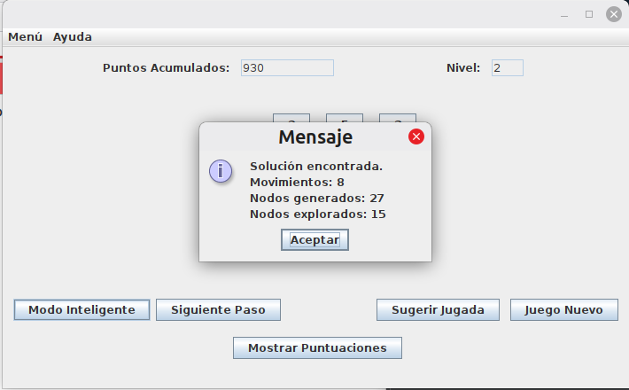
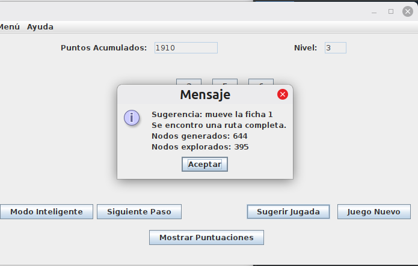

# Puzzle-8

Juego de Puzzle de 8 piezas desarrollado en **Java** utilizando **Swing** para la interfaz gráfica e inteligencia artificial clásica mediante el algoritmo de búsqueda **A\***.

La aplicación permite al jugador resolver el clásico Puzzle-8 a través de una interfaz interactiva basada en un tablero de 3×3.

Además de las mecánicas tradicionales del juego, el sistema incorpora herramientas de asistencia capaces de sugerir movimientos y calcular automáticamente la solución óptima para cualquier estado válido del tablero.

El proyecto implementa el algoritmo A* utilizando la **distancia Manhattan** como heurística admisible, permitiendo encontrar soluciones óptimas cuando estas existen. Además, incorpora un sistema de puntuaciones persistente basado en archivos de texto, múltiples niveles de dificultad y visualización paso a paso de las soluciones calculadas por el *solver inteligente*.

<p align="center">    
    <br>    
    <em>Figura 1. Estado inicial del tablero durante una partida.</em><br>
</p>

## Tecnologías Utilizadas

* Java
* Java Swing
* Algoritmo A*
* Distancia Manhattan
* Programación Orientada a Objetos
* Estructuras de Datos
* Persistencia mediante archivos de texto 

## Características

* Juego interactivo del Puzzle-8.
* Tres niveles de dificultad progresiva.
* Resolución automática mediante A*.
* Sistema de sugerencia de jugadas.
* Visualización paso a paso de la solución.
* Sistema de puntuaciones acumulativas.
* Persistencia de datos mediante archivos de texto.
* Interfaz gráfica desarrollada con Java Swing.

## Mecánicas del Juego

El objetivo consiste en ordenar las fichas del 1 al 8 dejando el espacio vacío en la esquina inferior derecha del tablero.

Durante la partida el jugador podrá:

* Mover fichas adyacentes al espacio vacío.
* Completar niveles con dificultad progresiva.
* Solicitar sugerencias de movimiento.
* Resolver automáticamente el tablero mediante el algoritmo A*.
* Consultar el ranking de puntuaciones.

### Niveles
```tabla
|  Nivel | Movimientos de mezcla |
|--------|-----------------------|
|    1   |          50           |
|    2   |         100           |
|    3   |         150           |
```

## Inteligencia Artificial

La aplicación incorpora un solver basado en el algoritmo **A\*** para calcular la secuencia óptima de movimientos hasta alcanzar el estado objetivo. La búsqueda utiliza la distancia Manhattan como heurística para estimar la cercanía de cada estado a la solución.

<p align="center">    
    <br>    
    <em>Figura 2. Resultado de búsqueda utilizando el algoritmo A*.</em><br>
</p>

La funcionalidad de resolución inteligente permite:

* Calcular soluciones óptimas.
* Configurar profundidad máxima.
* Limitar el número de nodos explorados.
* Visualizar estadísticas de búsqueda.
* Avanzar paso a paso por la solución encontrada.

## Sugerencia de Jugada

Además del solver completo, el sistema incluye una función de orientación que recomienda el siguiente movimiento más prometedor según el estado actual del tablero.

<p align="center">    
    <br>
    <em>Figura 3. Recomendación de movimiento generada por el sistema.</em><br>
</p>

## Sistema de Puntuaciones

La puntuación se calcula mediante:

```text
1000 - (movimientos × 10)
```

con un mínimo de:

```text
100 puntos
```

Las puntuaciones son almacenadas en un archivo de texto y se acumulan bajo el alias del jugador.

## Estructura del Proyecto

```text
Puzzle-8/
│
├── screenshots/
│   ├── nivel_inicial.png
│   ├── modo_inteligente.png
│   └── sugerencia_jugada.png
│
├── docs/
│   └── Reporte-Puzzle-8.pdf
│
├── Main_Puzzle/
│   └── src/
│       └── main_puzzle/
│
├── README.md
└── .gitignore
```

## Cómo ejecutar

### Desde NetBeans:

1. Clonar el repositorio.
2. Abrir la carpeta `Main_Puzzle` como proyecto en NetBeans.
3. Ejecutar presionando `F6` o mediante la opción `Run`.

### Desde Terminal

```bash
javac -d out Main_Puzzle/src/main_puzzle/*.java
java -cp out main_puzzle.Main_Puzzle
```

El archivo `puntuaciones.txt` se genera automáticamente la primera vez que se guarda una puntuación.

## Conceptos Aplicados

Durante el desarrollo del proyecto se aplicaron conocimientos en:

* Programación Orientada a Objetos.
* Inteligencia Artificial.
* Algoritmos de búsqueda heurística.
* Algoritmo A*.
* Distancia Manhattan.
* Java Swing.
* Estructuras de datos.
* Persistencia mediante archivos.
* Desarrollo de interfaces gráficas.

## Documentación

La documentación técnica del proyecto se encuentra disponible en:

* `docs/Reporte-Puzzle-8.pdf`

## Autores

* Venegas Cons, Aída Monserrat
* Zermeño Ojeda, Paola Sarahi
* Suárez Vega, Vladimir

## Nota

Proyecto desarrollado originalmente con fines académicos y educativos para practicar y fortalecer conocimientos relacionados con Programación Orientada a Objetos, estructuras de datos, algoritmos de búsqueda heurística, inteligencia artificial, persistencia de datos y desarrollo de interfaces gráficas utilizando Java Swing.

## Historial del Proyecto

* Desarrollo original: **junio de 2026**.
* Publicación y documentación en GitHub: **julio de 2026**.